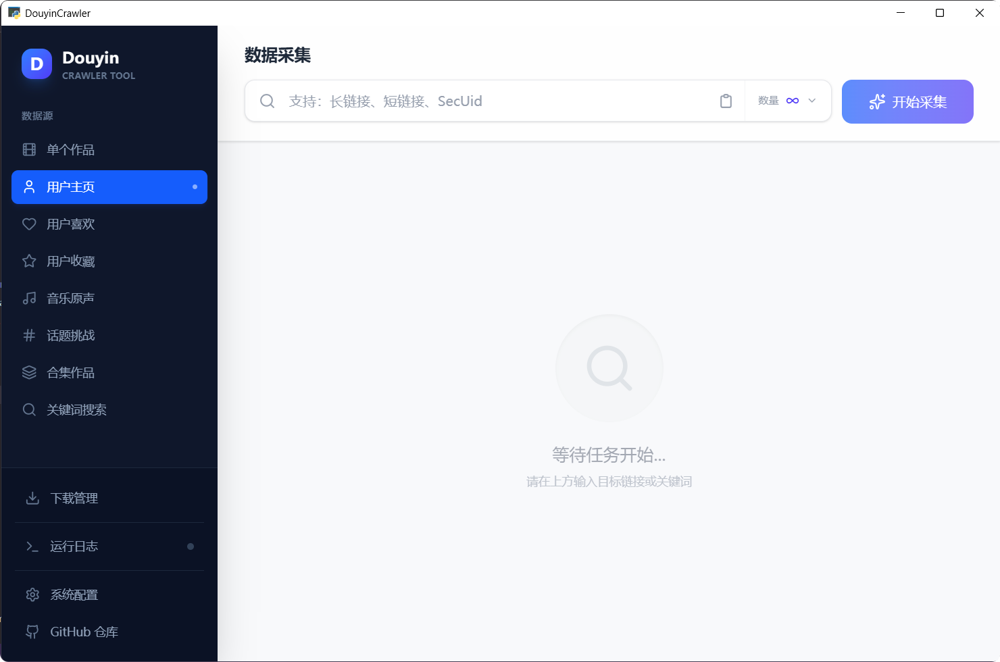

# ✨DouyinCrawler

**English | [Tiếng Việt](./README_VI.md) | [简体中文](./README.md)**

> ❤️[Open source is hard, welcome to star⭐](#star-history)

## 📢Disclaimer

> The original intention of this project is to learn `python` crawlers, command-line calls to `Aria2`, and `python` implementation of `WebUI` cases. It was later used to try AI programming (frontend and backend interaction parts are purely AI-generated). The application function is to obtain public information on the Douyin platform, only for testing and learning research, and is prohibited for commercial use or any illegal purposes.
>
> Any user who directly or indirectly uses or disseminates the content of this repository is solely responsible for their actions, and the contributors of this repository are not responsible for any consequences arising from such actions.
>
> **If relevant parties believe that the code of this project may infringe upon their rights, please contact me immediately to delete the relevant code**.
>
> Using the content of this repository means that you agree to all the terms and conditions of this disclaimer. If you do not accept the above disclaimer, please stop using this project immediately.

---

## 🏠Project Address

> [https://github.com/erma0/douyin](https://github.com/erma0/douyin)

## 🍬Features

### 📊 Data Collection
- ✅ Single work data
- ✅ User homepage posts
- ✅ User favorites (requires target to have open permissions)
- ✅ User collections (requires target to have open permissions)
- ✅ Hashtag/Challenge works
- ✅ Mix/Playlist works
- ✅ Music/Sound works
- ✅ Keyword search works
- ✅ Following users (CLI mode only, requires target to have open permissions)
- ✅ Follower users (CLI mode only, requires target to have open permissions)

### 🎯 Application Features
- 🔄 **Incremental Collection**: Smart incremental collection of user homepage works
- ⬇️ **Batch Download**: Integrated Aria2, supports video/image batch download
- 📄 **Title Download**: Optionally download work title text files
- 🖼️ **Cover Download**: Optionally download work cover images
- ⏱️ **Download Interval**: Configurable download task interval to avoid rate limiting
- 🎨 **Multiple Modes**: GUI desktop app / Web server / CLI command line
- 🌐 **RESTful API**: v2.0 provides complete HTTP API
- 🔧 **Cross-platform Support**: Windows / macOS / Linux

## 📸 Interface Preview



## 🚀Quick Start

### Requirements

> 📍Test environment: `Win10 x64` + `Python 3.12` + `Node.js 22.13.0` + `uv 0.9+`

### Windows Users

Download from [Releases](https://github.com/erma0/douyin/releases), extract and run `DouyinCrawler.exe`

### Web Service (Docker / All Platforms)

```bash
# Docker (Recommended)
docker compose up -d

# Or manual start
uv sync
cd frontend && pnpm install && pnpm build && cd ..
python -m backend.server
```

Visit `http://localhost:8000`

### Command Line (CLI Mode)

```bash
python -m backend.cli -u https://www.douyin.com/user/xxx -l 20
```

📖 For detailed usage instructions, please see [USAGE_EN.md](USAGE_EN.md)

## 🔨Build and Package

```powershell
# Interactive menu
.\quick-start.ps1

# Or direct packaging
.\scripts\build\pyinstaller.ps1
```

Script directory structure:
```
scripts/
├── build/          # Packaging scripts (PyInstaller / Nuitka)
├── setup/          # Environment setup (uv / aria2)
└── dev.ps1         # Development environment build
```

## 📊 Tech Stack

- **Backend**: Python 3.12, FastAPI, PyWebView
- **Frontend**: React 18, TypeScript, Vite
- **Download**: Aria2
- **Packaging**: PyInstaller / Nuitka

## Star History

[](https://star-history.com/#erma0/douyin&Date)
