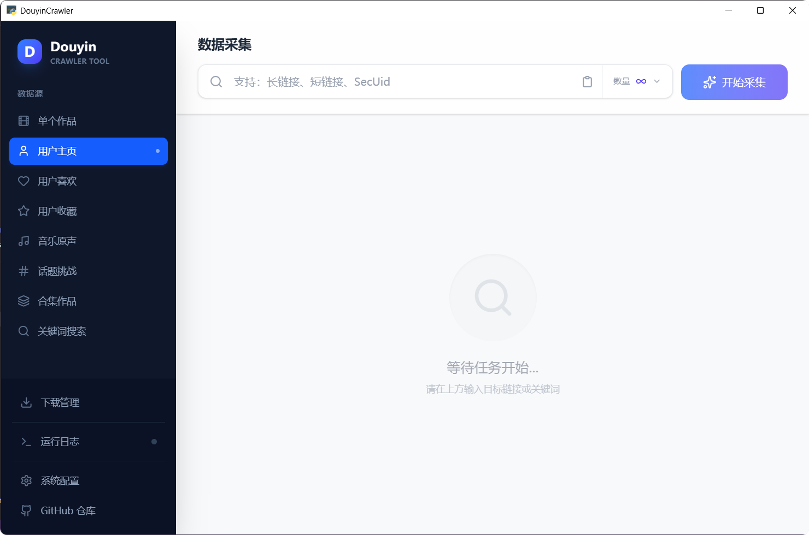

# ✨DouyinCrawler

**[English](./README_EN.md) | Tiếng Việt | [简体中文](./README.md)**

> ❤️[Mã nguồn mở không dễ dàng, hoan nghênh tặng sao⭐](#star-history)

## 📢Tuyên bố từ chối trách nhiệm

> Mục đích ban đầu của dự án này là học `python` crawler, gọi dòng lệnh `Aria2` và các trường hợp triển khai `WebUI` bằng `python`. Sau đó nó được sử dụng để trải nghiệm lập trình AI (phần giao diện người dùng và tương tác backend đều do AI tạo ra). Chức năng ứng dụng là lấy thông tin công khai trên nền tảng Douyin, chỉ dùng cho mục đích kiểm tra và nghiên cứu học tập, nghiêm cấm sử dụng cho mục đích thương mại hoặc bất kỳ mục đích bất hợp pháp nào.
>
> Bất kỳ người dùng nào sử dụng trực tiếp hoặc gián tiếp hoặc phổ biến nội dung của kho lưu trữ này đều phải tự chịu trách nhiệm về hành động của mình và những người đóng góp cho kho lưu trữ này không chịu trách nhiệm về bất kỳ hậu quả nào phát sinh từ những hành động đó.
>
> **Nếu các bên liên quan tin rằng mã của dự án này có thể vi phạm quyền của họ, vui lòng liên hệ với tôi ngay lập tức để xóa mã liên quan**.
>
> Việc sử dụng nội dung của kho lưu trữ này có nghĩa là bạn đồng ý với tất cả các điều khoản và điều kiện của tuyên bố từ chối trách nhiệm này. Nếu bạn không chấp nhận tuyên bố từ chối trách nhiệm trên, vui lòng ngừng sử dụng dự án này ngay lập tức.

---

## 🏠Địa chỉ dự án

> [https://github.com/erma0/douyin](https://github.com/erma0/douyin)

## 🍬Tính năng

### 📊 Thu thập dữ liệu
- ✅ Dữ liệu tác phẩm đơn
- ✅ Bài đăng trang chủ người dùng
- ✅ Tác phẩm yêu thích của người dùng (cần mục tiêu mở quyền)
- ✅ Tác phẩm bộ sưu tập của người dùng (cần mục tiêu mở quyền)
- ✅ Tác phẩm hashtag/thử thách
- ✅ Tác phẩm mix/playlist
- ✅ Tác phẩm nhạc/âm thanh
- ✅ Tác phẩm tìm kiếm từ khóa
- ✅ Người dùng đang theo dõi (chỉ chế độ CLI, cần mục tiêu mở quyền)
- ✅ Người theo dõi (chỉ chế độ CLI, cần mục tiêu mở quyền)

### 🎯 Tính năng ứng dụng
- 🔄 **Thu thập tăng dần**: Thu thập tăng dần thông minh các tác phẩm trang chủ người dùng
- ⬇️ **Tải xuống hàng loạt**: Tích hợp Aria2, hỗ trợ tải xuống hàng loạt video/hình ảnh
- 🎨 **Nhiều chế độ**: Ứng dụng GUI / Máy chủ Web / Dòng lệnh CLI
- 🌐 **RESTful API**: v2.0 cung cấp HTTP API đầy đủ
- 🔧 **Hỗ trợ đa nền tảng**: Windows / macOS / Linux

## 📸 Giao diện



## 🚀Bắt đầu nhanh

### Yêu cầu môi trường

> 📍Môi trường thử nghiệm: `Win10 x64` + `Python 3.12` + `Node.js 22.13.0` + `uv 0.9+`

### Người dùng Windows

Tải xuống từ [Releases](https://github.com/erma0/douyin/releases), giải nén và chạy `DouyinCrawler.exe`

### Dịch vụ Web (Docker / Tất cả nền tảng)

```bash
# Docker (Khuyên dùng)
docker compose up -d

# Hoặc khởi động thủ công
uv sync
cd frontend && pnpm install && pnpm build && cd ..
python -m backend.server
```

Truy cập `http://localhost:8000`

### Dòng lệnh (Chế độ CLI)

```bash
python -m backend.cli -u https://www.douyin.com/user/xxx -l 20
```

📖 Hướng dẫn sử dụng chi tiết vui lòng xem [USAGE_VI.md](USAGE_VI.md)

## 🔨Xây dựng và Đóng gói

```powershell
# Menu tương tác
.\quick-start.ps1

# Hoặc đóng gói trực tiếp
.\scripts\build\pyinstaller.ps1
```

Cấu trúc thư mục script:
```
scripts/
├── build/          # Script đóng gói (PyInstaller / Nuitka)
├── setup/          # Cấu hình môi trường (uv / aria2)
└── dev.ps1         # Xây dựng môi trường phát triển
```

## 📊 Tech Stack

- **Backend**: Python 3.12, FastAPI, PyWebView
- **Frontend**: React 18, TypeScript, Vite
- **Tải xuống**: Aria2
- **Đóng gói**: PyInstaller / Nuitka

## Lịch sử Star

[](https://star-history.com/#erma0/douyin&Date)
