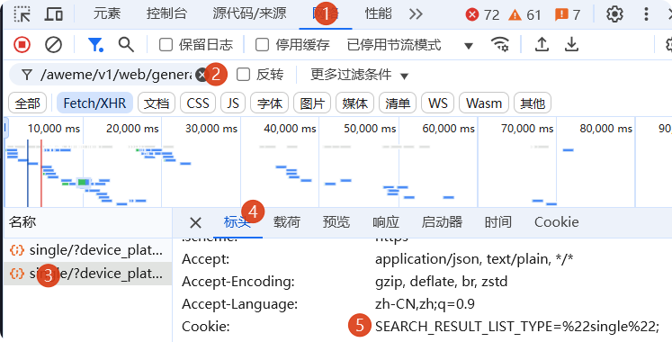

# 使用指南

**[English](./USAGE_EN.md) | [Tiếng Việt](./USAGE_VI.md) | 简体中文**

## 📋 目录

- [cookie 获取](#cookie获取)
- [功能说明](#功能说明)
- [常见问题](#常见问题)
- [高级用法](#高级用法)

---

## 🍪 cookie 获取

Cookie 是获取数据的必要凭证。

### 方式一：登录获取（推荐）

> 💡 仅 GUI 模式支持

1. 打开应用设置
2. 点击「登录获取」按钮
3. 在弹出的窗口中完成抖音登录（支持扫码/手机号）
4. 登录成功后 Cookie 会自动填入
5. 点击「保存配置」

### 方式二：手动获取

1. 访问 https://www.douyin.com 并登录
2. 按 `F12` 打开开发者工具
3. 切换到 `Network` 标签，刷新页面
4. 过滤器输入 `aweme`，点击任意请求
5. 在 `Request Headers` 中找到 `Cookie:` 字段，复制完整内容
6. 在应用设置中粘贴并保存

> 💡 提示：建议参照下图获取 Cookie，筛选 post 请求，复制`Cookie:`字段内容。



有效 Cookie 应包含：`sessionid`、`ttwid`、`__ac_nonce`

---

## 🎯 功能说明

### 采集类型

| 类型           | 说明                 | 输入示例                                  | 状态    |
| -------------- | -------------------- | ----------------------------------------- | ------- |
| **单个作品**   | 获取单个作品信息     | `https://www.douyin.com/video/7xxx`       | ✅ 正常 |
| **用户主页**   | 获取用户发布的作品   | `https://www.douyin.com/user/MS4wLjABxxx` | ✅ 正常 |
| **用户喜欢**   | 获取用户点赞的作品   | `https://www.douyin.com/user/MS4wLjABxxx` | ✅ 正常 |
| **用户收藏**   | 获取用户收藏的作品   | `https://www.douyin.com/user/MS4wLjABxxx` | ✅ 正常 |
| **话题挑战**   | 获取话题下的作品     | `https://www.douyin.com/hashtag/xxx`      | ✅ 正常 |
| **合集**       | 获取合集中的作品     | `https://www.douyin.com/mix/xxx`          | ✅ 正常 |
| **音乐原声**   | 获取使用该音乐的作品 | `https://www.douyin.com/music/7xxx`       | ✅ 正常 |
| **关键词搜索** | 搜索相关作品         | `风景`                                    | ✅ 正常 |
| **关注用户**   | 获取关注的用户       | `https://www.douyin.com/user/MS4wLjABxxx` | ✅ 正常 |
| **粉丝用户**   | 获取粉丝的用户       | `https://www.douyin.com/user/MS4wLjABxxx` | ✅ 正常 |

### 批量下载

需要 Aria2 支持：

```powershell
# 安装 Aria2
.\scripts\setup\aria2.ps1
```

点击"一键下载全部"，自动通过 Aria2 下载采集结果。

> 💡 提示：cli 模式下，默认开启下载功能，可通过`--no-download`参数禁用下载。

### 设置选项

| 选项         | 默认值       |
| ------------ | ------------ |
| 下载路径     | `./download` |
| 最大重试次数 | 3            |
| 最大并发数   | 5            |
| Aria2 端口   | 6800         |

---

## ❓ 常见问题

### Cookie 无效或已过期

重新获取 Cookie，确保包含 `sessionid` 等必要字段。

> 💡 提示：建议参照 [cookie 获取](#cookie获取) 的示意图操作。

### 采集结果为空

1. 检查链接格式是否正确
2. 更新 Cookie
3. 需目标用户开放权限

### 下载失败

1. 确认 Aria2 已安装：`aria2c --version`
2. 检查下载路径/磁盘空间
3. 尝试减少并发数
4. 部分任务下载失败原因不明，可多次重试

### 应用启动失败

1. 确认前端已构建
2. 确认已安装依赖
3. 确认未被防火墙或安全软件拦截
4. 确认已安装 webview2（windows gui 用户）

### 联系支持

提交 [Issue](https://github.com/erma0/douyin/issues) 时请包含：目标链接、错误信息、系统版本

---

## 🎓 高级用法

### 服务器模式

```bash
python -m backend.server              # 默认 8000 端口
python -m backend.server --port 9000  # 指定端口
python -m backend.server --dev        # 开发模式
```

环境变量：`DOUYIN_HOST`、`DOUYIN_PORT`、`DOUYIN_DEV`、`DOUYIN_LOG_LEVEL`

### HTTP API

```bash
# 启动采集任务
curl -X POST http://localhost:8000/api/task/start \
  -H "Content-Type: application/json" \
  -d '{"type": "favorite", "target": "https://www.douyin.com/user/MS4wLjABxxx", "limit": 20}'

# 获取结果
curl http://localhost:8000/api/task/results/task_xxx
```

主要端点：

- `POST /api/task/start` - 启动任务
- `GET /api/task/status` - 任务状态
- `GET /api/task/results/{task_id}` - 采集结果
- `GET /api/settings` - 获取设置
- `POST /api/settings` - 保存设置
- `GET /api/events` - SSE 事件流

### 命令行模式

```bash
# 基础用法
python -m backend.cli -u https://www.douyin.com/user/xxx -l 20

# 指定类型
python -m backend.cli -u 链接 -t favorite  # post/favorite/collection/hashtag/music/mix/aweme/search/follower/following

# 搜索筛选
python -m backend.cli -u "美食" -t search --sort-type 2 --publish-time 7

# 批量采集（urls.txt 每行一个链接）
python -m backend.cli -u urls.txt -l 50

# 仅采集不下载
python -m backend.cli -u 链接 --no-download
```

筛选参数：

- `--sort-type`: 0=综合，1=最多点赞，2=最新
- `--publish-time`: 0=不限，1=一天内，7=一周内，180=半年内
- `--filter-duration`: 0-1=1 分钟以下，1-5=1-5 分钟，5-10000=5 分钟以上

---

**祝使用愉快！** 🎉
